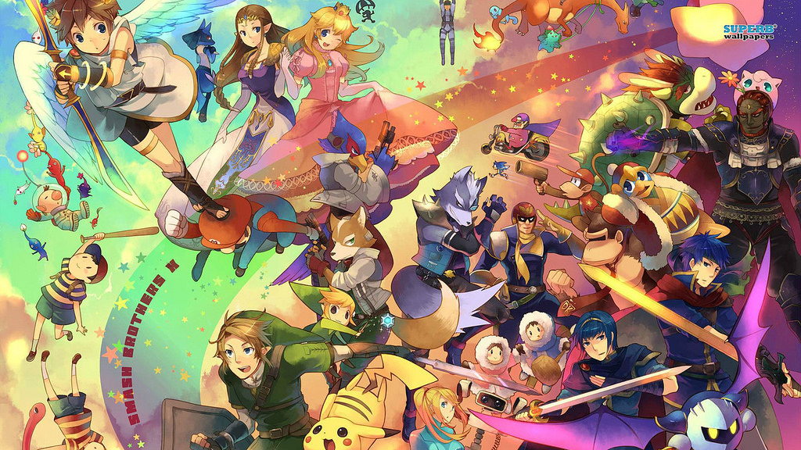

# fan-page
<!DOCTYPE html>
<html>
	<head>
		<title>Code Next Fan Page</title>
	</head>
	<body>
		<h1>Code Next Fan Page!</h1>
		

		<h2>Welcome to My Website!</h2>
		
(Pretty Cool huh...)

		 
		 
		<h3>I like...</h3>
		<ul>
			<li>reading,</li>
			 
			
			 
			 
			<li>coding,</li>
			 
			
			 
			 
			<li>playing video games,</li>
			 
			
			 
			 
			<li>and living life!</li>
			 
			

		</ul>
		 
		<h3>Here are some important websites:</h3>	
        <ol>
        	<li><a href="https://sites.google.com/csedge.org/
            		mocodenext/home">My Code Next Website!</a>		</li>
        	<li><a href="https://www.google.com/"				  		>The BEST Search Website! (JK)</a></li>
        	<li><a href="https://www.random.org/integers/">RNG?
        			</a></li>
        </ol>
        

        
Changes to this website will be coming soon!

         
        
Thanks for visiting!

		

	</body>
</html>